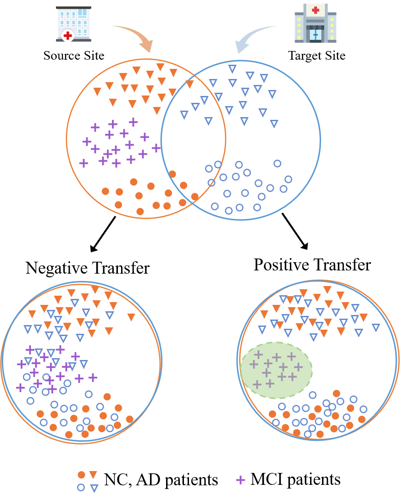
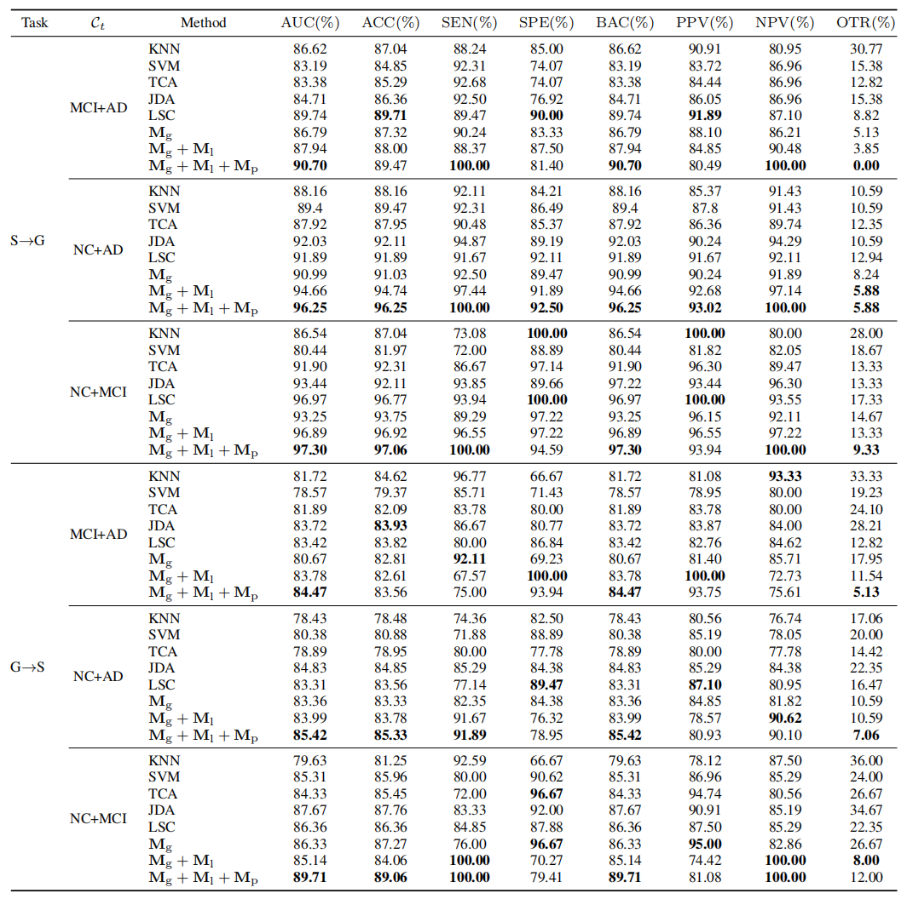

# Locality-Preserved Adaptive Joint Transfer (LPAJT) with Resting-State fMRI for Versatile Cross-Site Alzheimer’s Disease Diagnosis

## Overview

*"LPAJT minimizes the marginal and conditional distribution divergence of selected source samples and target samples, and enforces intra-class compactness to tackle the feature distortion problem caused by MMD."*

- ### Motivation

To boost diagnostic performance of models, local hospital expects to extend their small dataset by the rich-labeled dataset from large research institutions. However, this cross-site extension always suffers three major difficulties in real-world applications:

1) the inter-site heterogeneity will cause serious degradation of model performance, or even mismatch. 
2) only limited labeled data are available in the small dataset due to expensive labeling costs over medical data. 
3) the categories of subjects collected by the local hospital are usually a subset of those in the large research institutions. 

## Methodology

- ####  Landmark-based Global Alignment
  

 
where $\mathbf{A}\in \mathbb{R}^{k \times d}$ is the projection matrix to be optimized, $\alpha=\left[ \alpha^{1}; \ldots; \alpha^{c} \right] \in \mathbb{R}^{n_{s}}, \alpha^{c} = \left[\alpha_{1}^{c}  ; \cdots ; \alpha_{n^c_s}^{c} \right] \in \mathbb{R}^{n^c_s}$ and $\alpha_{i}$ denotes the confidence of source sample $\mathbf{x}_{s}^{i}$ selected as the landmark.

 
To learn $\alpha$, we firstly apply SVM-based classifiers to estimate the class posterior probability of the projected target domain data, and the probability label matrix is denoted as $\mathbf{P}_{t}=\left[\mathbf{p}_t^{1}; \ldots; \mathbf{p}_t^{n_t}\right] \in \mathbb{R}^{ n_t \times C_s}$. $\mathbf{p}_t^i=\left[\mathbf{p}_t^{i(1)}, \ldots, \mathbf{p}_t ^ {i\left(C_s\right)}  \right] \in \mathbb{R}^{C_s}$ is the probabilistic label of
target samples $\mathbf{x}_t^i$ and $\mathbf{p}_t^{i(c)}$ denotes the probability that $\mathbf{x}_t^i$ belongs to the $c$-th class.  We enable overall estimation across all source classes to search the relevant classes by computing the class level weights $\overline{\mathbf{p}}_t$. Then, all the same-class samples in $\alpha^c$ are assigned with the class weight $\overline{\mathbf{p}}_t^c$.  

- ####  Local Alignment via Weighted Semantic Loss

  

 
where $\mu_s^c$ denotes the $c$-th class center of source domain, i.e., $\mu_s^c=\frac{1}{n_s^c} \sum_{\mathbf{x}_j \in \mathcal{D}_s^c} \mathbf{x}_j$, and $\mathcal{D}_s^c$ is source domain belonging to the $c$-th category. $n_s^c$ is the total number of source domain samples in the specific $c$-th category $\mathcal{D}_s^c$.

- ####  Locality Preserving Loss

  

 
where $\mu_{c}=\frac{1}{n^{c}} \sum_{\mathbf{x}_{j} \in \mathcal{D}_{s}^{c} \cup \mathcal{D}_{t}^{c}} \mathbf{x}_{j}$ is the domain-irrelevant class center.

- ####   Reformulation and Optimization

 
To simplify the optimization, we introduce domain alignment matrices $\mathbf{M_g}$, $\mathbf{M_l}$, $\mathbf{M_p}$ and rewrite the above equations into the following equivalent form:

  

  

 
 

 
 
 
where the total sample matrix $\mathbf{X}= \left[\mathbf{X_s}, \mathbf{X_t}\right] \in \mathbb{R}^{d \times\left(n_s+n_t\right)}$ is defined for convenience, and $\mathbf{x}_i$ and $\mathbf{x}_j$ are the $i$-th and $j$-th columns of $\mathbf{X}$ respectively. $\operatorname{tr}(\cdot)$ is the trace of a matrix. 

The global alignment matrix $\mathbf{M_g}$, local alignment matrix $\mathbf{M_l}$, locality preserving matrix $\mathbf{M_p}$ are expressed as:
  

 

 

  

 where $\mathbf{M_g},\mathbf{M_l},\mathbf{M_p} \in \mathbb{R}^{\left(n_s+n_t\right) \times\left(n_s+n_t\right)}$, $\mathbf{I}$ is an identity matrix, and $\mathbf{Y_{s t}} = \mathbf{Y_s} \left(\mathbf{Y_s}^{\top} \mathbf{Y_s}\right)^{-1} \mathbf{P_t}^{\top}, \mathbf{Y_c}=\mathbf{Y}\left(\mathbf{Y}^{\top} \mathbf{Y}\right)^{-1} \mathbf{Y}^{\top},$ where
$\mathbf{Y}=\left[\mathbf{Y_s} ; \mathbf{P_t}\right]$.

By integrating the above three domain alignment matrices, we have the overall objective function:

  

Since it is a constrained convex optimization problem, we introduce Lagrangian multiplier and derive the Lagrange function as follows:
 
  

 
 where  $\mathbf{\Phi}$  is a diagonal matrix with Lagrangian multipliers defined as $\mathbf{\Phi}=\operatorname{diag}\left(\phi_1, \ldots, \phi_d\right)$ , and $\left(\phi_1, \cdots, \phi_d\right)$ are the $d$ smallest eigenvalues of the generalized eigendecomposition problem with $\frac{\partial \mathcal{L}(\mathbf{A}, \mathbf{\Phi})}{\partial \mathbf{A}}=0$:
 
 
  

 
 Finally, the optimal projection matrix $\mathbf{A}$ is composed of the corresponding $d$ eigenvectors derived by solving the above equation.
 
## Experiments

- ### Experiment Results
Performance of five different methods and module combinations under $\mathcal{C}_{t} =$ MCI+AD, NC+AD, NC+MCI scenarios. 

- ### Convergence Performance

We verify the convergence performance of LPAJT by inspecting the convergence performance of joint MMD distance, ACC, AUC and OTR(Outlier Transfer Rate).

- ### Landmark Confidence

We plot the class-level weights $\alpha$  for the source domain estimated from the unlabeled target samples.  For all scenarios, the shared classes across two sites get highest weights among all classes and the outlier classes weights is significantly smaller. 

- ### Embedding Similarity

The similarity matrices of the original data and the subspace embeddings $\mathbf{Z} = \mathbf{A}^{\top} \mathbf{X}$ over seven transfer scenarios.

- ### Parameter Sensitivity
To validate that LPAJT can achieve promising domain adaptation performance and encourage positive transfer effect in a wide range of parameter values,
we vary a parameter and the rest are fixed. 

